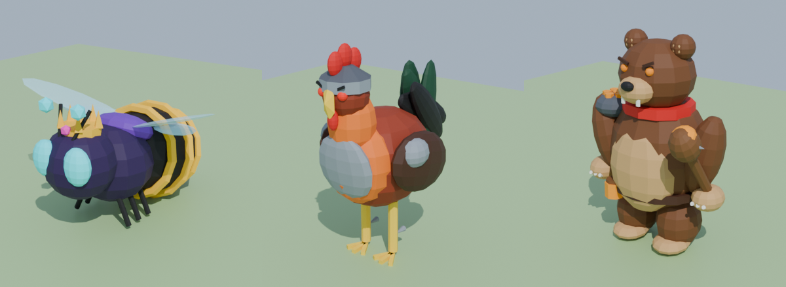

# Modelos para el juego



| Modelo | Qué es | Piezas al importar |
|---|---|---|
| **AbejaEclipse** | Abeja secreta (reina) de la zona de abejas: corona de oro, 4 alas, ojos y antenas cian, franjas doradas y aguijón magenta. | `Cuerpo`, `Alas`, `Brillo_Oro`, `Brillo_Cian`, `Brillo_Magenta` |
| **GalloGuardian** | Gallo que cuida los nidos: casco y pechera de acero, hombreras, espolones y ojos rojos. | `Cuerpo`, `Brillo_Rojo` |
| **OsoGuardian** | Oso guardián del panal: bandana roja, hombrera de panal, garrote con miel, bote de miel en el cinturón y ojos naranja. | `Cuerpo`, `Brillo_Naranja` |

Son modelos low-poly (entre 2,500 y 4,200 triángulos), muy por debajo del límite de Roblox.

## Cómo importarlos a Roblox Studio

1. Descarga el archivo `.fbx` del modelo (por ejemplo `GalloGuardian/GalloGuardian.fbx`).
2. En Roblox Studio ve a **Avatar → Importar 3D** (o **Archivo → Importar 3D**) y elige el `.fbx`.
3. Si el tamaño no se ve bien, cámbialo en las opciones del importador (*Scale* / *File Dimensions*). Los modelos están hechos a 1 unidad = 1 stud: la abeja mide unos 4 studs, el gallo unos 6 y el oso unos 7.5.
4. Si los colores salen blancos, abre cada MeshPart y en **TextureID** sube el archivo `paleta.png` de esa carpeta.

## Toques finales recomendados

- **Brillo:** selecciona las piezas `Brillo_*` y cambia **Material = Neon**. Así brillan los ojos, las antenas y las franjas.
- **Alas transparentes:** en la pieza `Alas` de la abeja pon **Transparency = 0.4**.
- Agrupa las piezas en un Model, pon `Anchored` según lo necesites y elige una `PrimaryPart` (`Cuerpo`).

## Cambiar o crear modelos

Los modelos se generan con `herramientas/generar_modelos.py`, que usa Blender desde Python:

```bash
pip install bpy==4.2.0
python3 herramientas/generar_modelos.py
```

Para cambiar colores, edita el diccionario `COLORES`. Para cambiar formas, edita las funciones `abeja_secreta`, `gallo_guardian` y `oso_guardian`.
