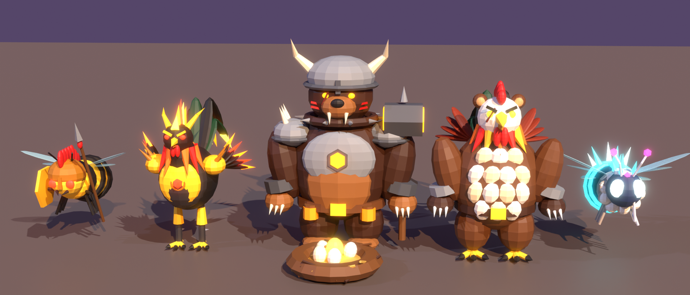

# Modelos para el juego

## Modelos épicos



| Modelo | Qué es | Piezas al importar |
|---|---|---|
| **GalloInfernal** | Gallo negro de palenque: cresta, cola y alas de fuego, cuernos y pechera de oro con rubí, hombreras con picos y navajas de pelea en los espolones. | `Cuerpo`, `Brillo_FuegoAmarillo`, `Brillo_FuegoNaranja`, `Brillo_FuegoRojo`, `Brillo_RojoBrillo` |
| **OsoGallo** | Bestia mitad oso mitad gallo: cuerpo y garras de oso, cabeza y cresta de gallo con orejas de oso, pecho de plumas, alas en la espalda, cola de hoz, cicatriz y cinturón de pelea. | `Cuerpo`, `Brillo_AmarilloBrillo` |
| **OsoTitan** | Oso de guerra que cuida el nido: yelmo con cuernos, coraza con emblema de panal, collar y hombreras con picos, martillo de panal, pintura de guerra y ojos de miel. | `Cuerpo`, `Brillo_Miel`, `Brillo_NaranjaBrillo` |
| **NidoDorado** | Nido de ramas y paja con 4 huevos normales y un huevo de oro brillante. | `Cuerpo`, `Brillo_OroBrillo` |
| **AbejaCristal** | Abeja reina secreta de cristal: cristales en la espalda, 6 alas, corona de cristal, cetro y aguijón de cristal. | `Cuerpo`, `Alas`, `Brillo_Cian`, `Brillo_BlancoCian`, `Brillo_Magenta` |
| **AbejaGuerrera** | Abeja espartana: casco con penacho rojo, armadura de oro, lanza, escudo de panal y ojos rojos. | `Cuerpo`, `Alas`, `Brillo_Miel`, `Brillo_RojoBrillo` |

Todos tienen entre 2,600 y 8,200 triángulos, por debajo del límite de Roblox.

## Primeros modelos


| Modelo | Qué es | Piezas al importar |
|---|---|---|
| **AbejaEclipse** | Abeja secreta (reina) de la zona de abejas: corona de oro, 4 alas, ojos y antenas cian, franjas doradas y aguijón magenta. | `Cuerpo`, `Alas`, `Brillo_Oro`, `Brillo_Cian`, `Brillo_Magenta` |
| **GalloGuardian** | Gallo que cuida los nidos: casco y pechera de acero, hombreras, espolones y ojos rojos. | `Cuerpo`, `Brillo_Rojo` |
| **OsoGuardian** | Oso guardián del panal: bandana roja, hombrera de panal, garrote con miel, bote de miel en el cinturón y ojos naranja. | `Cuerpo`, `Brillo_Naranja` |

## Cómo importarlos a Roblox Studio

1. Descarga el archivo `.fbx` del modelo (por ejemplo `GalloGuardian/GalloGuardian.fbx`).
2. En Roblox Studio ve a **Avatar → Importar 3D** (o **Archivo → Importar 3D**) y elige el `.fbx`.
3. Si el tamaño no se ve bien, cámbialo en las opciones del importador (*Scale* / *File Dimensions*). Los modelos están hechos a 1 unidad = 1 stud: las abejas miden unos 4-5 studs, los gallos unos 6-7, el OsoGallo unos 8 y el OsoTitan unos 9.5.
4. Si los colores salen blancos, abre cada MeshPart y en **TextureID** sube el archivo `paleta.png` de esa carpeta.

## Toques finales recomendados

- **Brillo:** selecciona las piezas `Brillo_*` y cambia **Material = Neon**. Así brillan los ojos, el fuego, los cristales y la miel.
- **Alas transparentes:** en la pieza `Alas` de las abejas pon **Transparency = 0.4**.
- Agrupa las piezas en un Model, pon `Anchored` según lo necesites y elige una `PrimaryPart` (`Cuerpo`).

## Cambiar o crear modelos

Los modelos se generan con `herramientas/generar_modelos.py`, que usa Blender desde Python:

```bash
pip install bpy==4.2.0
python3 herramientas/generar_modelos.py              # todos los modelos y el poster
python3 herramientas/generar_modelos.py OsoTitan     # solo uno
```

Para cambiar colores, edita el diccionario `COLORES`. Para cambiar formas, edita la función de cada modelo (`gallo_infernal`, `oso_gallo`, `oso_titan`, `nido_dorado`, `abeja_cristal`, `abeja_guerrera`...).
